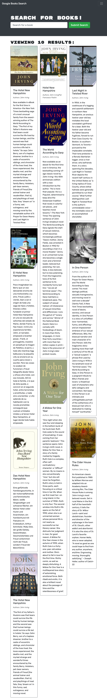

  # Title
MERN Book Search Engine

## Description
A full-stack book search engine application, Module 21 Challenge

## Table of Contents
* [Installation](#installation)
* [Usage](#usage)
* [Contributing](#contributing)
* [Tests](#tests)
* [License](#license)
* [Questions](#questions)
* [Screenshot](#screenshot)

## License
  
License Info: https://opensource.org/licenses/alphabetical 

## Installation
Navigate to https://obscure-basin-65208.herokuapp.com/ or run locally from CLI.

## Usage
Pretty self-explanatory. Create an account otr login and use as directed!

## Contributing
undefined

## Tests
run npm test, i guess?

## Questions 
### GitHub Profile link
https://github.com/github.com/J-Howell-kc  
### Email
Feel free to direct any questions to howell_j@hotmail.com. Thanks.

## Screenshot
;